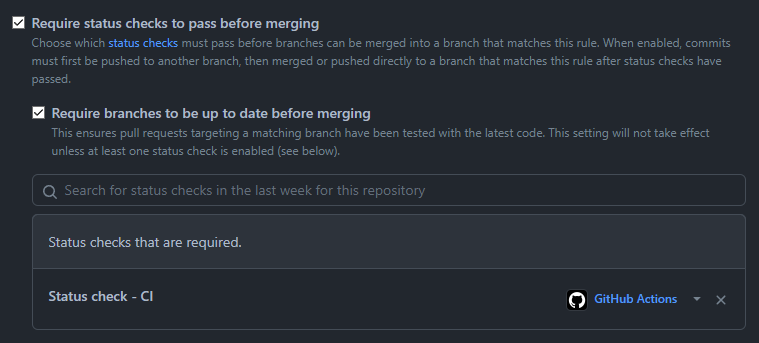

# GitHub Workflows

[GitHub Actions](https://docs.github.com/en/actions) reusable workflows and composed actions

## Content

- [Setup](#setup)
	- [Choose the right version](#choose-the-right-version)
- [Workflows](#workflows)
	- [Lock closed issues and PRs](#lock-closed-issues-and-prs)
- [Actions](#actions)
	- [Inputs](#inputs)
	- [Setup PHP](#setup-php)
	- [Setup Composer](#setup-composer)
	- [PHPUnit](#phpunit)
	- [PHPStan](#phpstan)
	- [PHP_CodeSniffer](#php_codesniffer)
	- [Infection PHP](#infection-php)
	- [Setup NodeJS](#setup-nodejs)
	- [Coveralls PHP upload](#coveralls-php-upload)
	- [Coveralls finish](#coveralls-finish)
	- [Status Check (for branch protection)](#status-check-for-branch-protection)
- [Examples](#examples)
	- [PHPUnit and Coveralls](#phpunit-and-coveralls-example)
	- [PHPStan](#phpstan-example)
	- [PHP_Codesniffer](#php_codesniffer-example)
	- [Infection PHP](#infection-php-example)

## Setup

Setup any workflow with few simple steps:

- Create `.github/workflows` directory
- Create file `workflow-name.yaml` in the directory
- Copy one of following workflows into the file
- Set required inputs (if workflow has any)
- Set `on` run condition (or use our recommended defaults)
- Good to go!

### Choose the right version

GitHub Actions do not support version constraints. Due to this we are locked to specific release or branch of a workflow.

With Orisai we have 3 version constraint types to choose from:

> `orisai/github-workflows/.github/actions/setup-php@v1`

- `@v1.x` - use branch `v1.x`, always get the latest commit from branch
- `@1.0.0` - use tag `1.0.0` (or newer), pointing to single commit in time
- `@v1` - use tag `v1`, pointing to the same commit as latest tag (`x.y.z`, e.g. `1.2.3`) in the same major version

In all examples is used the `@v1` variant as a preferred way for most users and to always get the latest stable release.

## Workflows

### Lock closed issues and PRs

Lock inactive closed issues and PRs after period of time.

`lock-closed-threads.yaml`:

```yaml
name: "Lock inactive closed issues and PRs"

on:
  schedule:
    - cron: "0 0 * * *"

jobs:
  lock:
    uses: "orisai/github-workflows/.github/workflows/lock-closed-threads.yaml@v1"
```

Inputs:

`issue-lock-inactive-days`

- Lock inactive closed issue after X days
- type: `string`
- default: `"30"`

`pr-lock-inactive-days`

- Lock inactive closed PR after X days
- type: `string`
- default: `"60"`

## Actions

Multiple actions composed into one, simpler and easier to read action.

Actions are designed to work together with others, check [examples](#examples) for full workflows using these actions.

### Inputs

Certain actions can be configured through inputs. Inputs are defined via `with` key. Check individual actions for
specific options.

```yaml
jobs:
  example:
    steps:
      - name: "example"
        uses: "example/action@v1.0"
        with:
          input-name: "Value"
```

### Setup PHP

Setup [PHP](https://www.php.net), with extensions, build caching and reporting of issues via GitHub Actions interface.

```yaml
jobs:
  example:
    strategy:
      matrix:
        php-version: [ "7.4", "8.0", "8.1", "8.2" ]

    steps:
      - name: "PHP"
        uses: "orisai/github-workflows/.github/actions/setup-php@v1"
        with:
          version: "${{ matrix.php-version }}"
          token: "${{ secrets.GITHUB_TOKEN }}"
```

Inputs:

`version`

- PHP version
- type: `string`
- required

`coverage`

- Code coverage tool
- type: `string`
- default: `"none"`
- values: `"none"`, `"pcov"`, `"xdebug"`

`extensions`

- PHP extensions
- type: `string` (extension names separated by a comma `,`)
- default: `"fileinfo, intl, json, mbstring, sodium"`

`token`

- GitHub token for Composer to prevent being rate limited by GitHub API
- type: `string`
- required

### Setup Composer

Setup [Composer](https://getcomposer.org) (v2), with dependencies caching and installation.

```yaml
jobs:
  example:
    steps:
      - name: "Composer"
        uses: "orisai/github-workflows/.github/actions/setup-composer@v1"
```

Inputs:

`command`

- Composer's installation command
- type: `string`
- default: `"composer install --no-interaction --no-progress --prefer-dist"`
- Preferably use something like `composer install --no-interaction --no-progress --no-dev --classmap-authoritative` for
  projects

### PHPUnit

Run [PHPUnit](https://phpunit.de), store cached data between runs and reporting of issues via GitHub Actions interface.

Expects you to have PHPUnit installed and have path to its cache set.

```yaml
jobs:
  example:
    steps:
      - name: "PHPUnit"
        uses: "orisai/github-workflows/.github/actions/phpunit@v1"
        with:
          command: "vendor/bin/phpunit"
          cache-path: "var/tools/PHPUnit"
```

Inputs:

`command`

- PHPUnit command
- type: `string`
- required

`cache-path`

- PHPUnit cache directory
- type: `string`
- required

### PHPStan

Run [PHPStan](https://phpstan.org) and store cached data between runs.

Expects you to have PHPStan installed and have path to its cache set.

```yaml
jobs:
  example:
    steps:
      - name: "PHPStan"
        uses: "orisai/github-workflows/.github/actions/phpstan@v1"
        with:
          command: "vendor/bin/phpstan"
          cache-path: "var/tools/PHPStan"
```

Inputs:

`command`

- PHPStan command
- type: `string`
- required

`cache-path`

- PHPStan cache directory
- type: `string`
- required

### PHP_CodeSniffer

Run [PHP_CodeSniffer](https://github.com/squizlabs/PHP_CodeSniffer) and store cached data between runs.

Expects you to have PHP_CodeSniffer installed and have path to its cache set.

```yaml
jobs:
  example:
    steps:
      - name: "PHP_CodeSniffer"
        uses: "orisai/github-workflows/.github/actions/php-codesniffer@v1"
        with:
          command: "vendor/bin/phpcs"
          cache-path: "var/tools/PHP_CodeSniffer"
```

Inputs:

`command`

- PHP_CodeSniffer command
- type: `string`
- required

`cache-path`

- PHP_CodeSniffer cache directory
- type: `string`
- required

### Infection PHP

Run [Infection PHP](https://infection.github.io), store cached data between runs and send coverage report
to [Stryker dashboard](https://dashboard.stryker-mutator.io).

Expects you to have Infection installed and have path to its cache set.

```yaml
jobs:
  example:
    steps:
      - name: "Infection PHP"
        uses: "orisai/github-workflows/.github/actions/infection-php@v1"
        with:
          command: "vendor/bin/infection"
          cache-path: "var/tools/Infection"
          stryker-token: "${{ secrets.STRYKER_DASHBOARD_API_KEY }}"
```

Inputs:

`command`

- Infection command
- type: `string`
- required

`cache-path`

- Infection cache directory
- type: `string`
- required

`stryker-token`

- [Stryker](https://dashboard.stryker-mutator.io) token for submitting code coverage
- type: `string`
- optional

### Setup NodeJS

Setup [NodeJS](https://nodejs.dev), with dependencies caching and installation.

```yaml
jobs:
  strategy:
    matrix:
      nodejs-version: [ "14" ]

  example:
    steps:
      - name: "NodeJS"
        uses: "orisai/github-workflows/.github/actions/setup-nodejs@v1"
        with:
          version: "${{ matrix.nodejs-version }}"

      - name: "Build assets"
        run: "npm run start"
```

Inputs:

`version`

- NodeJS version
- type: `string`
- required

`command`

- NodeJS's installation command
- type: `string`
- default: `"npm ci"`

### Coveralls PHP upload

Upload code coverage report to [coveralls.io](https://coveralls.io)
via [php-coveralls](https://github.com/php-coveralls/php-coveralls). Requires finishing report
via [coveralls-finish](#coveralls-finish) action.

```yaml
jobs:
  example:
    steps:
      - name: "Coveralls"
        if: "${{ github.event_name == 'push' }}"
        uses: "orisai/github-workflows/.github/actions/coveralls-php-upload@v1"
        with:
          config: "tools/.coveralls.yml"
          token: "${{ secrets.GITHUB_TOKEN }}"
```

Inputs:

`config`

- Configuration file of php-coveralls
- type: `string`
- required

`token`

- GitHub token for Coveralls
- type: `string`
- required

### Coveralls finish

Finish [coveralls.io](https://coveralls.io) report started via [Coveralls PHP upload](#coveralls-php-upload) action.

```yaml
jobs:
  example:
    steps:
      - name: "Coveralls"
        if: "${{ github.event_name == 'push' }}"
        uses: "orisai/github-workflows/.github/actions/coveralls-finish@v1"
        with:
          token: "${{ secrets.GITHUB_TOKEN }}"
```

Inputs:

`token`

- GitHub token for Coveralls
- type: `string`
- required

### Status Check (for branch protection)

If you use branch protection rules and want to check all jobs from matrix pass you may end up configuring tens of matrix
variations. e.g. PHP 7.2 - 8.1 on Linux, Windows and Mac result into 15 variations of single job. Each of them has to be
set via GitHub UI.



Instead, we just set one job per workflow to be checked and job itself specifies (by `needs`) which jobs have to pass.

```yaml
jobs:
  status-check:
    name: "Status check - ${{ github.workflow }}"
    runs-on: "ubuntu-latest"
    needs: [ "list", "of", "required", "jobs" ]

    if: "${{ always() }}"

    steps:
      - name: "Check required jobs are successful"
        uses: "orisai/github-workflows/.github/actions/status-check@v1"
        with:
          needs: "${{ toJSON(needs) }}"
```

Inputs:

`needs`

- `${{ needs }}` context
- type: `string`
- required
- Just use the value from example. This input is really just a workaround.

`allow-cancelled`

- Allow jobs being cancelled
- type: `string`
- default: `"true"`
- Should be bool, but that's not supported. Change to `"false"` to turn it off.

`allow-skipped`

- Allow jobs being skipped
- type: `string`
- default: `"true"`
- Should be bool, but that's not supported. Change to `"false"` to turn it off.

## Examples

Complete workflow examples using our composed [actions](#actions).

Be aware examples don't use the commands directly, but call `make` instead. All [Orisai](https://github.com/orisai)
repositories are using Makefile with all the commands required for development and CI, and we would like to encourage
you to do so too. You may clone e.g. [orisai/auth](https://github.com/orisai/auth) and check its Makefile. Or just use
our [library template](https://github.com/orisai/library-template), and you are good to go.

### PHPUnit and Coveralls example

[PHPUnit](https://phpunit.de) run workflow example with code coverage report to [coveralls.io](https://coveralls.io).

```yaml
name: "Tests"

on:
  pull_request:
    types: [ "opened", "synchronize", "edited", "reopened" ]
    paths-ignore:
      - "docs/**"
  push:
    branches:
      - "**"
    paths-ignore:
      - "docs/**"
  schedule:
    - cron: "0 8 * * 1" # At 08:00 on Monday

concurrency:
  group: "${{ github.workflow }}-${{ github.ref }}"
  cancel-in-progress: true

jobs:
  tests:
    name: "Tests"
    runs-on: "${{ matrix.operating-system }}"

    strategy:
      matrix:
        operating-system: [ "ubuntu-latest", "macos-latest", "windows-latest" ]
        php-version: [ "7.4", "8.0", "8.1", "8.2" ]
        composer-flags: [ "" ]
        include:
          - operating-system: "ubuntu-latest"
            php-version: "7.4"
            composer-flags: "--prefer-lowest"
      fail-fast: false

    steps:
      - name: "Checkout"
        uses: "actions/checkout@v2"

      - name: "PHP"
        uses: "orisai/github-workflows/.github/actions/setup-php@v1"
        with:
          version: "${{ matrix.php-version }}"
          coverage: "pcov"
          token: "${{ secrets.GITHUB_TOKEN }}"

      - name: "Composer"
        uses: "orisai/github-workflows/.github/actions/setup-composer@v1"

      - name: "PHPUnit"
        uses: "orisai/github-workflows/.github/actions/phpunit@v1"
        with:
          command: "make coverage-clover"
          cache-path: "var/tools/PHPUnit"

      - name: "Coveralls"
        if: "${{ github.event_name == 'push' }}"
        uses: "orisai/github-workflows/.github/actions/coveralls-php-upload@v1"
        with:
          config: "tools/.coveralls.yml"
          token: "${{ secrets.GITHUB_TOKEN }}"

      - name: "Upload logs"
        uses: "actions/upload-artifact@v2"
        with:
          name: "Logs - Tests (${{ matrix.operating-system }}, ${{ matrix.php-version }}, ${{ matrix.composer-flags }})"
          path: "var/log"
          if-no-files-found: "ignore"

  coverage-finish:
    name: "Code coverage finish"
    needs: "tests"
    runs-on: "${{ matrix.operating-system }}"

    strategy:
      matrix:
        include:
          - operating-system: "ubuntu-latest"
            php-version: "8.1"
      fail-fast: false

    steps:
      - name: "Coveralls"
        if: "${{ github.event_name == 'push' }}"
        uses: "orisai/github-workflows/.github/actions/coveralls-finish@v1"
        with:
          token: "${{ secrets.GITHUB_TOKEN }}"
```

### PHPStan example

[PHPStan](https://phpstan.org) run workflow.

```yaml
name: "Static analysis"

on:
  pull_request:
    types: [ "opened", "synchronize", "edited", "reopened" ]
    paths-ignore:
      - "docs/**"
  push:
    branches:
      - "**"
    paths-ignore:
      - "docs/**"
  schedule:
    - cron: "0 8 * * 1" # At 08:00 on Monday

concurrency:
  group: "${{ github.workflow }}-${{ github.ref }}"
  cancel-in-progress: true

jobs:
  static-analysis:
    name: "Static analysis"
    runs-on: "${{ matrix.operating-system }}"

    strategy:
      matrix:
        include:
          - operating-system: "ubuntu-latest"
            php-version: "8.1"
      fail-fast: false

    steps:
      - name: "Checkout"
        uses: "actions/checkout@v2"

      - name: "PHP"
        uses: "orisai/github-workflows/.github/actions/setup-php@v1"
        with:
          version: "${{ matrix.php-version }}"
          token: "${{ secrets.GITHUB_TOKEN }}"

      - name: "Composer"
        uses: "orisai/github-workflows/.github/actions/setup-composer@v1"

      - name: "PHPStan"
        uses: "orisai/github-workflows/.github/actions/phpstan@v1"
        with:
          command: "make phpstan"
          cache-path: "var/tools/PHPStan"
```

### PHP_Codesniffer example

[PHP_CodeSniffer](https://github.com/squizlabs/PHP_CodeSniffer) run workflow.

Uses `--report=checkstyle` argument and `vendor/bin/cs2pr` script
from [staabm/annotate-pull-request-from-checkstyle](https://github.com/staabm/annotate-pull-request-from-checkstyle) to
show errors in GitHub interface.

```yaml
name: "Coding standard"

on:
  pull_request:
    types: [ "opened", "synchronize", "edited", "reopened" ]
    paths-ignore:
      - "docs/**"
  push:
    branches:
      - "**"
    paths-ignore:
      - "docs/**"
  schedule:
    - cron: "0 8 * * 1" # At 08:00 on Monday

concurrency:
  group: "${{ github.workflow }}-${{ github.ref }}"
  cancel-in-progress: true

jobs:
  coding-standard:
    name: "Coding standard"
    runs-on: "${{ matrix.operating-system }}"

    strategy:
      matrix:
        include:
          - operating-system: "ubuntu-latest"
            php-version: "8.1"
      fail-fast: false

    steps:
      - name: "Checkout"
        uses: "actions/checkout@v2"

      - name: "PHP"
        uses: "orisai/github-workflows/.github/actions/setup-php@v1"
        with:
          version: "${{ matrix.php-version }}"
          token: "${{ secrets.GITHUB_TOKEN }}"

      - name: "Composer"
        uses: "orisai/github-workflows/.github/actions/setup-composer@v1"

      - name: "PHP_CodeSniffer"
        uses: "orisai/github-workflows/.github/actions/php-codesniffer@v1"
        with:
          command: "make cs ARGS='--report=checkstyle -q | vendor/bin/cs2pr'"
          cache-path: "var/tools/PHP_CodeSniffer"
```

### Infection PHP example

[Infection PHP](https://infection.github.io) run workflow.

```yaml
name: "Mutations"

on:
  pull_request:
    types: [ "opened", "synchronize", "edited", "reopened" ]
    paths-ignore:
      - "docs/**"
  push:
    branches:
      - "**"
    paths-ignore:
      - "docs/**"
  schedule:
    - cron: "0 8 * * 1" # At 08:00 on Monday

concurrency:
  group: "${{ github.workflow }}-${{ github.ref }}"
  cancel-in-progress: true

jobs:
  tests-mutations:
    name: "Test for mutants"
    runs-on: "${{ matrix.operating-system }}"

    strategy:
      matrix:
        include:
          - operating-system: "ubuntu-latest"
            php-version: "8.1"

    if: "github.event_name == 'push'"

    steps:
      - name: "Checkout"
        uses: "actions/checkout@v2"

      - name: "PHP"
        uses: "orisai/github-workflows/.github/actions/setup-php@v1"
        with:
          version: "${{ matrix.php-version }}"
          coverage: "pcov"
          token: "${{ secrets.GITHUB_TOKEN }}"

      - name: "Composer"
        uses: "orisai/github-workflows/.github/actions/setup-composer@v1"

      - name: "PHPUnit"
        uses: "orisai/github-workflows/.github/actions/phpunit@v1"
        with:
          command: "make mutations-tests"
          cache-path: "var/tools/PHPUnit"

      - name: "Infection PHP"
        uses: "orisai/github-workflows/.github/actions/infection-php@v1"
        with:
          command: "make mutations-infection ARGS='--logger-github'"
          cache-path: "var/tools/Infection"
          stryker-token: "${{ secrets.STRYKER_DASHBOARD_API_KEY }}"

      - name: "Upload logs"
        uses: "actions/upload-artifact@v2"
        with:
          name: "Logs - Mutations"
          path: "var/coverage/mutations/infection.log"
          if-no-files-found: "ignore"
```
